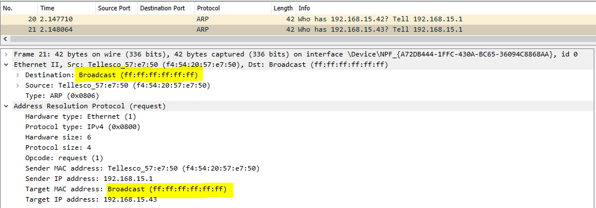
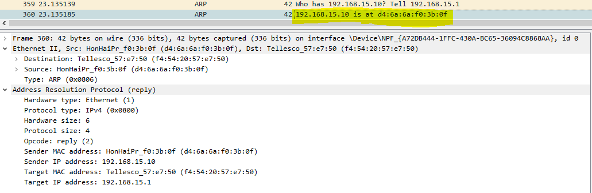

# ARP Address Resolution Protocol
Address Resolution Protocol is a protocol used to map physical (MAC) addressess to internet (IP) addressess. Network and end devices like routers and computers uses ARP to build a map table of the local area network. This table is consulted when a device wants to send packets to another one on the same LAN. Its data is used to populate the L2 ethernet header.

# Traditional ARP
[Traditional ARP](https://www.practicalnetworking.net/series/arp/traditional-arp/) consists of a ARP request being broadcasted to the network and the target device responding with a reply. Take in consideration the following scenario: a brand new device (D1) is connected to the network. It receives the IP 192.168.2.15 from the router. D1 ARP table is at this point essentialy blank (only contains the default static map info). D1 wants to communicate with D2. Before it can sends packets to D2. It needs to acquire D2's ethernet address. So, it will broadcast a ARP request, asking "who has X ip?". All the devices on the broadcast domain will receive the packet, but only device with X ip will respond, which in this example would be D2. D2 replies with an ARP reply, informing what its MAC address is. When D1 receives that packet it will update its ARP table. 

The router constantly broadcasts ARP requests to build a map of the local area network.

## ARP Request

    

## ARP Reply

    

# Gratuitous ARP
[Gratuitous ARP](https://www.practicalnetworking.net/series/arp/gratuitous-arp/) consists of an ARP reply that was not prompted by a request. It is sent as a broadcast to the network. The hosts receiving it doesn't necessarily need to process or cache that information.

# ARP Spoofing/Poisoning
[ARP Spoofing or ARP Poisoning](https://www.veracode.com/security/arp-spoofing#:~:text=What%20Is%20ARP%20Spoofing%3F,or%20server%20on%20the%20network.) consists of sending spoofed ARP packets to a host on a network with the objective of updating its ARP table with the attacker's MAC address and the IP of a legitimate machine that the host would like to communicate with. From that point on many other types of attacks can take place.

# This tool
This tool is just a sample, it will allow you to build ARP replys to be sent to a machine or broadcasted, is very simple, you just need fill in the ethernet and ARP header. Check this standalone version to packet creation [netpforgery](https://github.com/malipense/netpforgery).